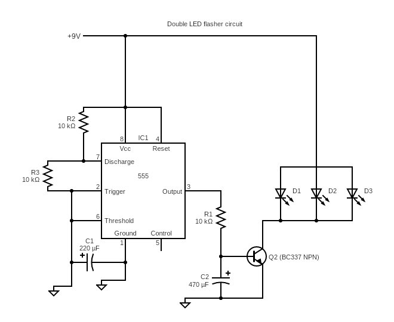

# Project: Skull with flashing LEDs

# ID:23192
---
We thought an ordinary skull decoration would be so much more interesting with flashing LEDs inside it so we created this project! Please **[watch our construction video using this link][2]** first to get a clear idea.

Following is the working circuit diagram you will need if you want to build this cool looking spooky skull for Halloween or some other occasion.

You can power the circuit using an ordinary 9V battery.

You will need a plastic skull to work with and following is a suitable one you can go for.

**[1 - Plastic human skull decoration][1]**

If you build this project, please share your thoughts and suggestions with the rest of circuitapps community in the comments section of **[our YouTube video][2]**. Also, please feel free to talk about any interesting modifications you make and your experimentations, if any !

## Project Challenges
This project is pretty straightforward but there is one note of caution here:

### **Caution 1 - Cut the skull carefully**

You will need to cut the plastic skull into two halves down the middle. Take your time while doing this and create a straight cut to make life easier during the hot glue phase later on.

## Useful tips

### **Tip 1:**
Make sure the LEDs are always facing the shiny side of the metal foils to maximize the light reflections in the skull.

### **Tip 2:**
After building the skull, to make sure it stands straight, use a heavy object like ceramic tiles or metal base to hot glue it on. Alternatively, you may also hang it off the ceiling ;)

GOOD LUCK & ENJOY BUILDING THIS COOL PROJECT !

[1]: https://www.amazon.com/GiftExpress-Assorted-Realistic-Halloween-Decoration/dp/B0CG2N2Z9B
[2]: https://youtube.com/shorts/k4v0ZmGjX2M

